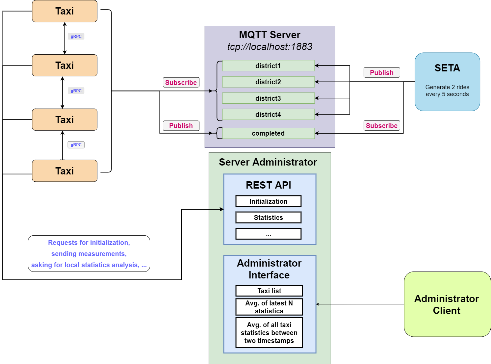

# **SETA** - **SE**lf-driving **TA**-xi service

Project for the course of "Distributed and Pervasive Systems" A.A. 2021/2022 for M.Sc.'s in Computer Science.

The goal of the project is to develop SETA (SElf-driving TAxi service), a
peer-to-peer system of self-driving taxis for the citizens of a smart city.

## General functioning of the project

  

## Ricart & Agrawala algorithm for mutual exclusion
The algorithm was developed for guarantee the mutual exclusion to a critical section between multiple processes in a distributed system.

The timestamps of the messages are sent in broadcast (in parallel) through the gRPC call `coordinateRechargeStream()`. The logical clock synchronization is guaranteed through **Lamport's algorithm**.

Let's consider the following diagram, the nodes in red want to access to the critical section, while the other nodes are doing anything else.

  

More in depth in the first phase (in which the requests are parallelized) the processes will build their lists of dependent nodes. These lists will contain all the nodes which got a smaller timestamp relative to their.

A node will be able to enter a critical section (*i.e.*, in this project is the recharging operation) if it receives the ACKs from all the other nodes. If this doesn't happens it will have to wait the residual ACKs.

  

Once that a node has finished with the recharging operation, it will sends an ACK message to the taxi of his list/queue. The first taxis who will fill the number of attended ACKs will access the critical section, and then story repeats.

  

## Ride election
The SETA process generates two rides each 5 seconds on a random district, these two rides are posted on the respective topic of the district. Each taxi is subscribed only on the topic of the district in which it currently belongs.

For semplicity let's assume only one ride (the ride 5) to be published from the SETA process on the first district. All the processes which are subscribed to this topic (inside the green circle) will receive the message for the ride 5.

  

An election mechanism will start through the gRPC call `coordinateRideStream()`, the request will be performed in broadcast (also to taxi out from district 1) and they will be executed in parallel. The request will contain the *Euclidean distance to the starting point*, the *battery levels* and the *ID* of taxi which is sending the request.

For sake of semplicity we are seeing the evolution of the algorithm only from the point of view of the process 1. 

  

Let's also assume that the process 1 is the process with the smallest distance from the starting point of the ride. Essentially, this means that the taxi who receives the request will all answer with an ACK (this means that they got a worst distance, battery or grater ID respect to process 1), only in this case the process 1 will achieve the consensus.

  

Now the process 1 can execute the ride 5, before it even pass to the local execution of the ride, it publish a message containing the ride 5 on the `seta/smartcity/comopleted` topic. This will allow to stop recycling this message (we will see what is it below) and also makingknow to the taxi which ride ignore since it is already taken.

Thsi because all the taxi will have a local list containing all the completed rides taken from the topic, in this way they know which ride to avoid. 

  

## Ride recycling
There is a system that enforces the recycling of runs, each run that is generated on the topics is embedded within the relative queue of the district. The priority of the queues is based on the order (run ID) of run generation, so older runs will be preferred.

  

