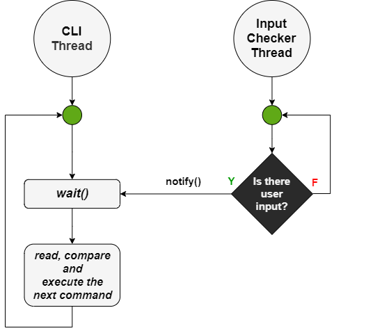
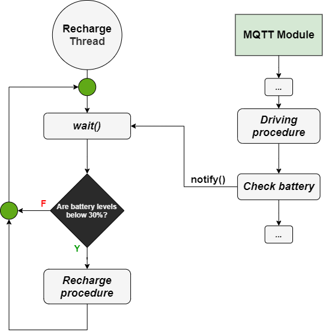
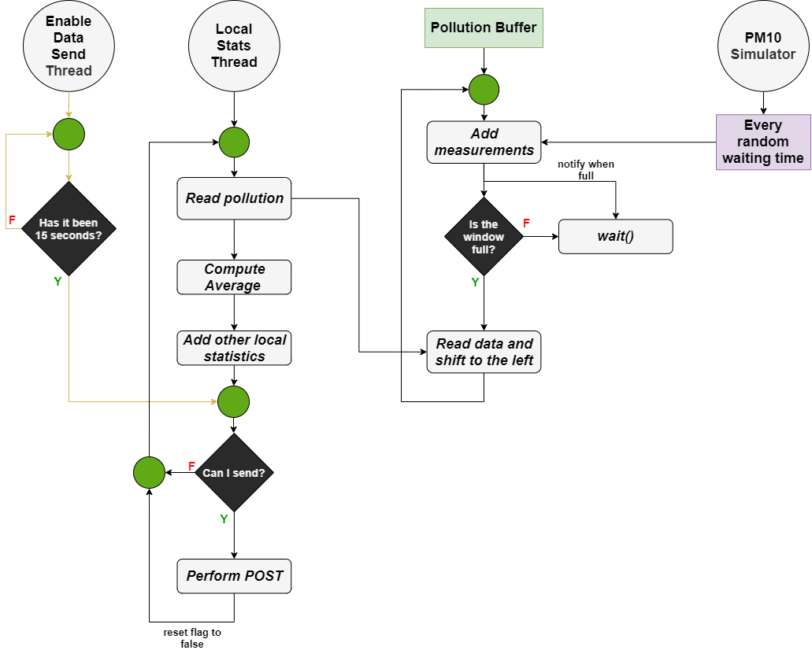
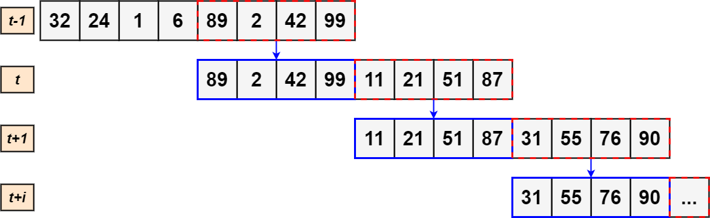

# **SETA** - **SE**lf-driving **TA**-xi service

Project for the course of "Distributed and Pervasive Systems" A.A. 2021/2022 for M.Sc.'s in Computer Science.

The goal of the project is to develop SETA (SElf-driving TAxi service), a
*peer-to-peer* system of self-driving taxis for the citizens of a smart city.

## Dev Tools & Languages
Languages :
* Java SDK 18.0.2

Technologies :
* [gRPC](https://grpc.io/)
* [MQTT](https://mqtt.org/)
* REST API
* [Protocol Buffers](https://developers.google.com/protocol-buffers)

Tools :
* IntelliJ IDEA
* [draw.io](https://github.com/jgraph/drawio-desktop/releases) for drawing diagrams
* Git & GitHub as versioning system

Within this README are different conceptual diagrams that broadly define the general operation of the system, distributed algorithms, and synchronization procedures.

These diagrams do not rigidly follow any model as they are simple and extensively commented.

Guidelines :
* Rhombuses correspond to flow controls.
* Rectangles to of operations/procedures.
* Green circles are collection points.
* Rectangle colors stand for an object belonging to a certain class (so if there are multiple rectangles of the same color, they are multiple instances of the same class).
* White circles correspond to processes (used in diagrams for distributed algorithms).
* Gray circles correspond to threads (used in diagrams for synchronization).

## General functioning of the project
This is an outline of general operation of the system, it corresponds to what is required in the assignment delivery [document](Project_DPS_2022___SETA.pdf).

  

## Distributed algorithms diagrams
### Ricart & Agrawala algorithm for mutual exclusion
The algorithm was developed for guarantee the mutual exclusion to a critical section between multiple processes in a distributed system.

The timestamps of the messages are sent in broadcast (in parallel) through the gRPC call `coordinateRechargeStream()`. The logical clock synchronization is guaranteed through **Lamport's algorithm**.

Let's consider the following diagram, the nodes in red want to access to the critical section, while the other nodes are doing anything else.

  

More in depth in the first phase (in which the requests are parallelized) the processes will build their lists of dependent nodes. These lists will contain all the nodes which got a smaller timestamp relative to their.

A node will be able to enter a critical section (*i.e.*, in this project is the recharging operation) if it receives the ACKs from all the other nodes. If this doesn't happens it will have to wait the residual ACKs.

  

Once that a node has finished with the recharging operation, it will sends an ACK message to the taxi of his list/queue. The first taxis who will fill the number of attended ACKs will access the critical section, and then story repeats.

  

### Ride election algorithm
The SETA process generates two rides each 5 seconds on a random district, these two rides are posted on the respective topic of the district. Each taxi is subscribed only on the topic of the district in which it currently belongs.

For simplicity let's assume only one ride (the ride 5) to be published from the SETA process on the first district. All the processes which are subscribed to this topic (inside the green circle) will receive the message for the ride 5.

  

An election mechanism will start through the gRPC call `coordinateRideStream()`, the request will be performed in broadcast (also to taxi out from district 1) and they will be executed in parallel. The request will contain the *Euclidean distance to the starting point*, the *battery levels* and the *ID* of taxi which is sending the request.

For sake of simplicity we are seeing the evolution of the algorithm only from the point of view of the process 1.

  

Let's also assume that the process 1 is the process with the smallest distance from the starting point of the ride. Essentially, this means that the taxi who receives the request will all answer with an ACK (this means that they got a worst distance, battery or grater ID respect to process 1), only in this case the process 1 will achieve the consensus.

  

Now the process 1 can execute the ride 5, before it even pass to the local execution of the ride, it publish a message containing the ride 5 on the `seta/smartcity/completed` topic. This will allow to stop recycling this message (we will see what is it below) and also making know to the taxi which ride ignore since it is already taken.

This because all the taxi will have a local list containing all the completed rides taken from the topic, in this way they know which ride to avoid.

  

#### Ride recycling
There is a system that enforces the recycling of runs, each run that is generated on the topics is embedded within the relative queue of the district. The priority of the queues is based on the order (run ID) of run generation, so older runs will be preferred.

  

## Conceptual schemes of synchronizations

### User input
Command entry by users is handled by two threads. One thread for reading and executing the commands entered (**CLI**, *Command Line Interface*), and one thread for controlling the *input stream* (**Input Checker**).

This approach is designed in such a way as to avoid "*busy waiting*" phenomena. There is a shared *dummy object* between the two objects; the thread for the CLI waits to receive an encoding on this object, notification will be sent by the Input Checker when the presence of user input is detected.

  

### Recharge operation
There is a thread that monitors cab battery levels (**Recharge Thread**), to avoid "*busy waiting*" phenomena a *dummy object* is shared between this thread and the **MQTT module**.

The recharge thread is initially waiting and will check the battery levels only after receiving the notification on the shared *dummy object*.

As we know, the MQTT module receives races message for it's own district, and its callbacks can in turn call methods (which basically function like threads). Upon completion of the function that takes care of the run we notify the *dummy object* through `notify()`.

This way a check of battery levels will be made after a run is finished. The charging procedure will only be started if the battery levels are below 30 percent.

  

### Local statistics
The collection and submission of local statistics involves different agents :

* A **PM10 simulator** that generates random measurements of pollution levels at a random cadence.
* A **Pollution Buffer** which is a data structure used for the collection and self-management (*sliding window* technique) of measurements generated by the PM10 simulator.
* A thread for reading the PM10 measurements buffered in the Pollution Buffer, with addition of the other local statistics (*total traveled km, battery levels, accomplished runs, ...*) and subsequent sending on the administrator server via POST request (**Local Stats Thread**).
* A thread to ensure local statistics are sent every 15 seconds (**Enable Data Send Thread**).

  

The reading of measurements is done by the Local Stats Thread, the latter though is governed by the operation of the Pollution Buffer's internal data structure.

Once the array of measurements is read, its average is calculated. Then a data structure is created that will contain both this average of measurements and the other local statistics :
* Total traveled kilometers
* Battery levels
* Total accomplished runs

Every fifteen seconds you will be able to send this data structure to the administrator server via POST, to ensure this you use a thread (Enable Data Thread) that sets a boolean (initialized to false) to true.

That boolean variable will be checked by the Local Stats Thread, if true, then the POST request will be executed.

Then the flag will be set to false again, and you will have to wait 15 seconds again for it to be reactivated.

#### Sliding window
The Pollution Buffer presents a method that is constantly called at an unknown time by the PM10 simulator. The Pollution Buffer internal structure consists of a *sliding window* of 50% of size 8 (each element is a PM10 measurements).

Once the maximum capacity of our internal data structure is reached, then I can guarantee that it will be read by the Local Stats Thread. The read operation involves a left shift of 50% of the elements (*i.e.,* 4 elements), henceforth the elements added by the PM10 simulator will be allocated starting from the fifth.
When the last element (the eighth) is added again, then a new reading of the sliding window can be performed again.

In this way the various sliding windows that are read will share four elements, *i.e.,* the sliding window of iteration `t-1` will have the last four elements equal to the first four elements of the sliding window at time `t`.

  

