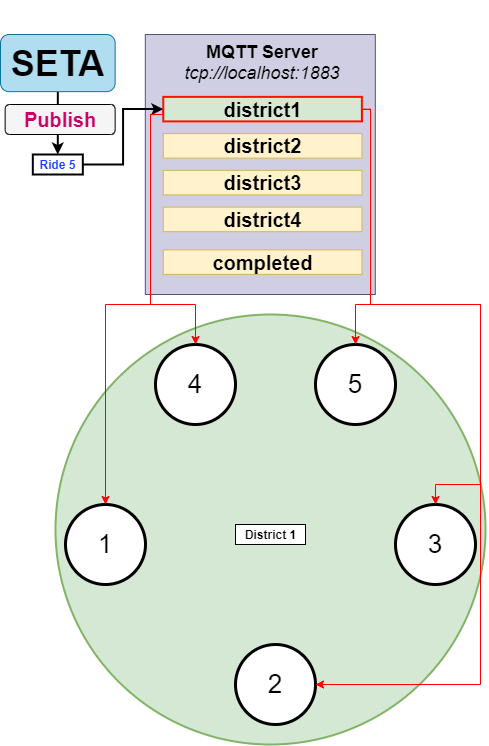

# **SETA** - **SE**lf-driving **TA**-xi service

Project for the course of "Distributed and Pervasive Systems" A.A. 2021/2022 for M.Sc.'s in Computer Science.

The goal of the project is to develop SETA (SElf-driving TAxi service), a
peer-to-peer system of self-driving taxis for the citizens of a smart city.

## General functioning of the project

## Ricart & Agrawala algorithm for mutual exclusion
The algorithm was developed for guarantee the mutual exclusion to a critical section between multiple processes in a distributed system.

The timestamps of the messages are sent in broadcast via the gRPC call `somethingidon'tremember()`, the logical clock synchronization is guaranteed through Lamport's algorithm.

Let's assume the nodes in red want to access to the critical section, while the other nodes are just doing anything else.

More in depth in the first phase (which is parallelized) the processes will build their lists of dependent nodes. These list will contain all the nodes which got a smaller timestamp relative to their.

A node will be able to enter a critical section (i.e. in this project is the recharging operation) if receives the ACKs from all the other nodes. If this doesn't happens it will have to wait the residual ACKs.

Once that a node has finished with the recharging operation, it will sends an ACK message to the taxi of his list/queue. The first taxis who will fill the number of attended ACKs will access the critical section, and then story repeats.

## Ride election

## Ride recycling
There is a system that enforces the recycling of runs, each run that is generated on the topics is embedded within the relative queue of the district.

The priority of the queues is based on the order (run ID) of run generation, so older runs will be preferred.347. -[  6]

